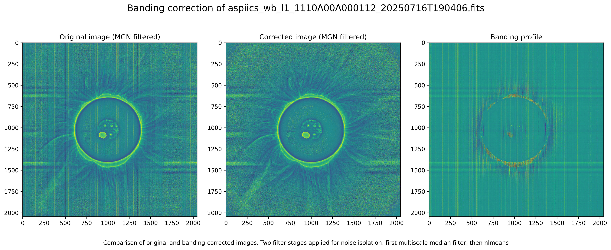

# Improved ASPIICS processing

This repository is based on S.Shestov's [aspiics-level-2-processor](https://gitlab-as.oma.be/P3SC/sergei-s-aspiics-level-2-processor) and [aspiics-level-3-processor](https://gitlab-as.oma.be/P3SC/sergei-s-aspiics-level-3-processor).

It includes changes to both processing stages for producing cleaner output products. For convenience, Jupyter notebooks are included to batch-process many ASPIICS files at ones with multithreading.

## License

This repository is licensed under the MIT License for original code.

[l2_processor](l2_processor) and [l3_processor](l3_processor) are licensed under the MIT License, Copyright (c) 2025 Sergei Shestov.

## How to use

1. Install the repository and it's dependencies
    * Install [uv package manager](https://docs.astral.sh/uv/getting-started/installation/)
    * Create a virtual environment: `uv venv`
    * Activate the environment: `.venv\bin\activate`
    * Install the dependencies: `uv sync`
1. Place the contents of the ASPIICS [calibration data release 1.0](https://gitlab-as.oma.be/P3SC/p3sc_calibration_data_repository/-/releases) in the [`calibration-data`](calibration-data) directory
1. Use [`process_l2_batch.ipynb`](process_l2_batch.ipynb) to batch-process the L2 files
1. Use [`process_l3_batch.ipynb`](process_l3_batch.ipynb) to batch-process the L3 files

## Description of Modifications

1. Fixed an issue in [`l2_master.py`](l2_processor/l2_master.py) where saturated pixels were not getting marked correctly. Now all out of range pixels from the nonlinearity correction will be flagged as saturated.
1. Added smooth 30 px wide blending between exposures in [`l3_merge.py`](l3_processor/l3_merge.py) using the new[`soft_merge()`](https://github.com/sschmaus/aspiics_processing/blob/d37a291a8b9119dcf6974bfe102e28071eeebc48/l3_processor/aspiics_misc.py#L39) function to smooth the transition
1. Added prefiltering to the affine transformation in [`aspiics_misc.py`](l3_processor/aspiics_misc.py) to improve the sharpness of resampled outputs. This required dealing with NaN values separately.
1. Added a multipass correction algorithm for the collumn-to-collumn variations remaining after L2 calibration. It works by isolating the erroneous signal using either median or non-local means prefiltering and then subtracts it from the image. The filter parameters are defined in [`banding_correction()`](https://github.com/sschmaus/aspiics_processing/blob/227a4c4862e958ae423d1c234e616408443817bc/l2_processor/aspiics_detector.py#L126) and the filter code is implemented in [`banding_denoise.py`](l2_processor/banding_denoise.py)
  

## Further thoughts

* The bias correction leaves obvious residuals visible as collumn-to-collumn variations. These are mostly static between frames but some lines vary a lot over time.
* The collumn-to-variations have two separate components alternating with the image row, this is likely caused by the sensor readout architecture.
* The flatfield seems to contain a lot of bias. This results in stronger collumn-to-collumn variations in bright areas. However, correcting the collumn-to-collumn variations in the Flat made things worse, apparently there is an actual collumn-to-collumn variation in the gain that needs to be corrected by the flat.
* There is another low frequency banding like artefact, but orthogonal to the normal banding. It seems to vary depending on which areas of the sensor are saturated. It is partially corrected by the banding filter, but needs a dedicated correction.
